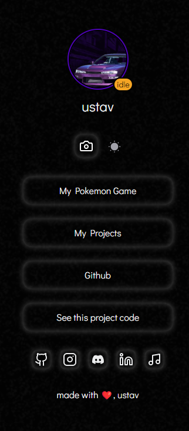
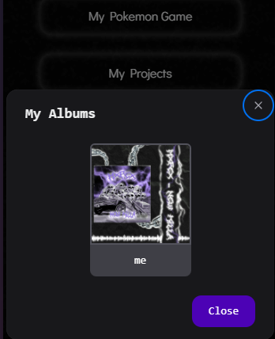

# based linktree
- uses next ui 
- [config file](./config.json)
- has album to show pics n videos
- supports discord activities through [lanyard](https://github.com/Phineas/lanyard)
## usage
- go to [config file](./config.json)
```json
{
    "nickname": "ustav",
    "lanyard": {
      "active": true, <  if you dont wish to use it, set to false
      "discordId": "801073563368947742"
    },
    "accentColor": "#4c02b5",
    "avatarImgSrc": "/assets/profile.png",
    "buttons": [
      {
        "title": "My Pokemon Game",
        "link": "https://pokedoro-next.vercel.app/"
      },
      {
        "title": "My Projects",
        "link": "https://uprojects.vercel.app/"
      },
      {
        "title": "Github",
        "link": "https://github.com/xyztavo"
      },
      {
        "title": "See this project code",
        "link": "https://github.com/xyztavo/DaisyDevLinks"
      }
    ],
    "githubLink": "https://github.com/xyztavo",
    "instagramLink": "https://www.instagram.com/luna.gustah/",
    "linkedInLink": "https://www.linkedin.com/in/gustavo-luna-6a33942aa/",
    "discordLink": "https://discord.com/users/801073563368947742",
    "ytMusicLink": "https://music.youtube.com/channel/UCazPZA5I0goXo85P_LAJAkA?si=FoBmOLIaz_O-aBJd",
    "footer": "made with ❤️, ustav"
  }
  
```
## screen shots



